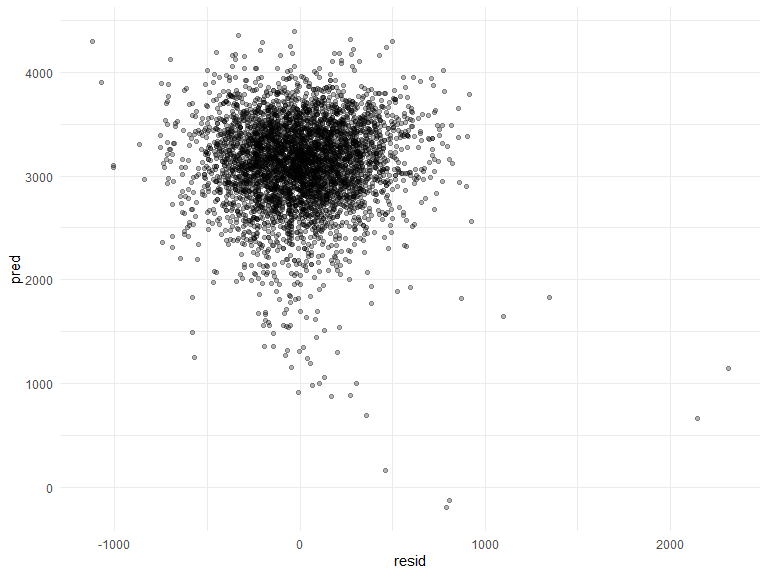
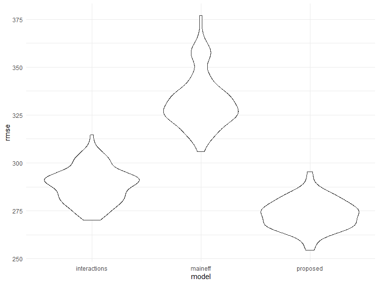
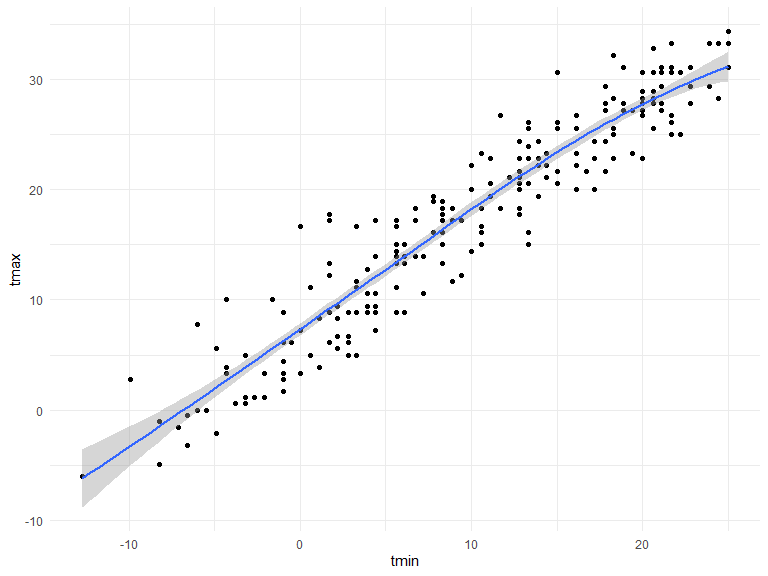
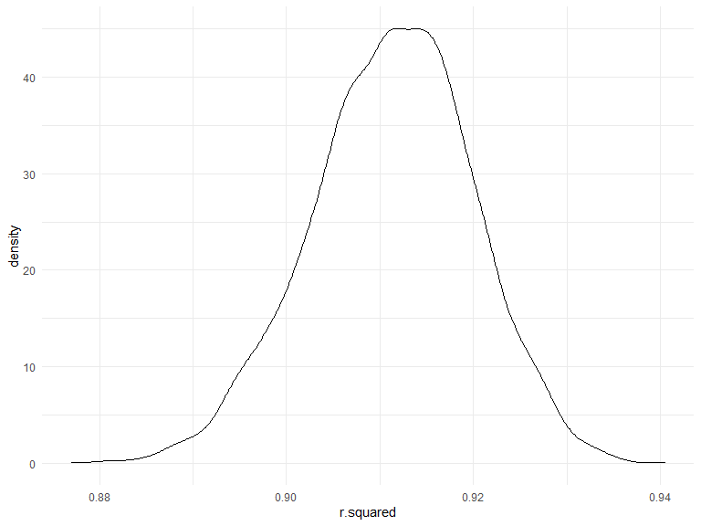
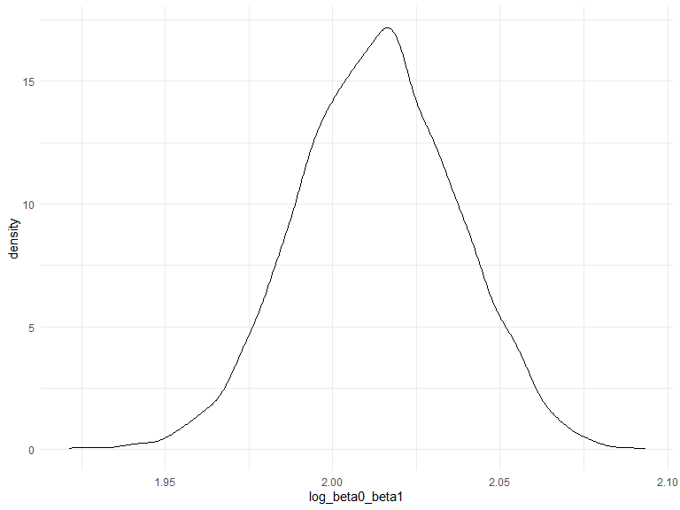

Homework 6
================
Kailey Rishovd
12/09/2020

## Problem 1

``` r
homicide_df = 
  read_csv("data/homicide-data.csv", na = c("", "NA", "Unknown")) %>%  
  mutate(
    city_state = str_c(city, state, sep = ", "), 
    victim_age = as.numeric(victim_age), 
    resolution = case_when(
      disposition == "Closed without arrest" ~ 0, 
      disposition == "Open/No arrest"        ~ 0, 
      disposition == "Closed by arrest"      ~ 1)
  ) %>% 
  filter(
    victim_race %in% c("White", "Black"), 
    city_state != "Tulsa, AL") %>% 
  select(city_state, resolution, victim_age, victim_race, victim_sex)
```

Start with Baltimore, MD…

``` r
baltimore_df = 
  homicide_df %>% 
  filter(city_state == "Baltimore, MD")

glm(resolution ~ victim_age + victim_sex + victim_race, 
    data = baltimore_df, 
    family = binomial()) %>% 
  broom::tidy() %>% 
  mutate(
    OR = exp(estimate), 
    CI_lower = exp(estimate - 1.96 * std.error), 
    CI_upper = exp(estimate + 1.96 * std.error)
  ) %>% 
  select(term, OR, starts_with("CI")) %>% 
  knitr::kable(digits = 3)
```

| term              |    OR | CI\_lower | CI\_upper |
| :---------------- | ----: | --------: | --------: |
| (Intercept)       | 1.363 |     0.975 |     1.907 |
| victim\_age       | 0.993 |     0.987 |     1.000 |
| victim\_sexMale   | 0.426 |     0.325 |     0.558 |
| victim\_raceWhite | 2.320 |     1.648 |     3.268 |

Try this across cities…

``` r
models_results_df = 
  homicide_df %>% 
  nest(data = -city_state) %>% 
  mutate(
    models = 
      map(.x = data, ~glm(resolution ~ victim_age + victim_race + victim_sex, data = .x, family = binomial())), 
    results = map(models, broom::tidy)
  ) %>% 
  select(city_state, results) %>% 
  unnest(results) %>% 
  mutate(
    OR = exp(estimate), 
    CI_lower = exp(estimate - 1.96 * std.error), 
    CI_upper = exp(estimate + 1.96 * std.error)
  ) %>% 
  select(city_state, term, OR, starts_with("CI"))
```

Create a plot that shows the estimated ORs and CIs for each city…
organized according to estimate OR

``` r
models_results_df %>% 
  filter(term == "victim_sexMale") %>% 
  mutate(city_state = fct_reorder(city_state, OR)) %>% 
  ggplot(aes(x = city_state, y = OR)) + 
  geom_point() + 
  geom_errorbar(aes(ymin = CI_lower, ymax = CI_upper)) + 
  theme(axis.text.x = element_text(angle = 90, hjust = 1))
```


This plot shows the odds ratios comparing male homicide victims to
female homicide victims…Since most of the ORs are less than 1 (meaning
that the outcome is less likely for males than the reference group
“females”), we know that, relative to female homicides, male homicides
are less likely to be resolved by arrest. Conversely, female homicides
are more often resolved by arrest.

## Problem 2

Load and clean data

``` r
birthweight_df = 
  read_csv("./data/birthweight.csv") %>% 
  janitor::clean_names() %>% 
  mutate(
    babysex = as.factor(babysex), 
    frace = as.factor(frace), 
    malform = as.factor(malform), 
    mrace = as.factor(mrace)
  )
```

Regression model for birthweight…

#### Modeling Process

Factors the underlay birthweight based on literature search: `babysex`
`bhead` `blength` `delwt` `fincome` `frace` `gaweeks` `momage` `mrace`
`parity` `pnumlbw` `pnumgsa` `ppbmi` `ppwt` `smoken`

Take out factors that are too alike and might cause multicolinearity:
`babysex` `bhead` `blength` `delwt` `fincome` `frace` `gaweeks` `momage`
`mrace` `parity` `pnumlbw` `ppbmi` `ppwt` `smoken`

``` r
factors_of_int_df = 
  lm(bwt ~  babysex + bhead + blength + delwt + fincome + frace + gaweeks + momage + mrace + parity + pnumlbw + ppbmi + ppwt + smoken, data = birthweight_df)
```

Look at results..

``` r
summary(factors_of_int_df)
```

    ## 
    ## Call:
    ## lm(formula = bwt ~ babysex + bhead + blength + delwt + fincome + 
    ##     frace + gaweeks + momage + mrace + parity + pnumlbw + ppbmi + 
    ##     ppwt + smoken, data = birthweight_df)
    ## 
    ## Residuals:
    ##      Min       1Q   Median       3Q      Max 
    ## -1093.35  -184.72    -4.27   173.72  2355.26 
    ## 
    ## Coefficients: (1 not defined because of singularities)
    ##               Estimate Std. Error t value Pr(>|t|)    
    ## (Intercept) -5691.3761   103.0812 -55.213  < 2e-16 ***
    ## babysex2       28.6925     8.4637   3.390 0.000705 ***
    ## bhead         130.7985     3.4500  37.912  < 2e-16 ***
    ## blength        75.0335     2.0205  37.135  < 2e-16 ***
    ## delwt           4.1247     0.3942  10.464  < 2e-16 ***
    ## fincome         0.3067     0.1791   1.712 0.087000 .  
    ## frace2         13.3553    46.1297   0.290 0.772200    
    ## frace3         19.7755    69.2842   0.285 0.775331    
    ## frace4        -49.2524    44.6486  -1.103 0.270040    
    ## frace8          4.1866    74.0602   0.057 0.954922    
    ## gaweeks        11.5305     1.4651   7.870 4.44e-15 ***
    ## momage          0.4997     1.1996   0.417 0.677036    
    ## mrace2       -151.1299    46.0362  -3.283 0.001036 ** 
    ## mrace3        -94.7768    71.8744  -1.319 0.187358    
    ## mrace4        -56.5599    45.1181  -1.254 0.210057    
    ## parity         94.5298    40.4697   2.336 0.019546 *  
    ## pnumlbw             NA         NA      NA       NA    
    ## ppbmi          -9.1544     2.5794  -3.549 0.000391 ***
    ## ppwt           -1.1065     0.5726  -1.932 0.053391 .  
    ## smoken         -4.8710     0.5867  -8.302  < 2e-16 ***
    ## ---
    ## Signif. codes:  0 '***' 0.001 '**' 0.01 '*' 0.05 '.' 0.1 ' ' 1
    ## 
    ## Residual standard error: 272.5 on 4323 degrees of freedom
    ## Multiple R-squared:  0.7182, Adjusted R-squared:  0.717 
    ## F-statistic:   612 on 18 and 4323 DF,  p-value: < 2.2e-16

``` r
broom::glance(factors_of_int_df)
```

    ## # A tibble: 1 x 12
    ##   r.squared adj.r.squared sigma statistic p.value    df  logLik    AIC    BIC
    ##       <dbl>         <dbl> <dbl>     <dbl>   <dbl> <dbl>   <dbl>  <dbl>  <dbl>
    ## 1     0.718         0.717  272.      612.       0    18 -30499. 61038. 61166.
    ## # ... with 3 more variables: deviance <dbl>, df.residual <int>, nobs <int>

Looking at the summary of the model p-values: `fincome`, `frace`,
`momage`, `mrace` 3 and 4, and `ppwt` are not significant to the model.
Further, `parity` is not highly significant to the model. I will keep
`mrace` because one indicator variable was significant. Additionally,
`pnumlbw` does not have enough data points. In my proposed model I will
exclude all of the variables mentioned above, except `mrace.`

R square is 71.8%

``` r
proposed_model_df = 
  lm(bwt ~ bhead + blength + mrace + delwt + gaweeks + ppbmi + smoken, data = birthweight_df)

summary(proposed_model_df)
```

    ## 
    ## Call:
    ## lm(formula = bwt ~ bhead + blength + mrace + delwt + gaweeks + 
    ##     ppbmi + smoken, data = birthweight_df)
    ## 
    ## Residuals:
    ##      Min       1Q   Median       3Q      Max 
    ## -1121.74  -179.62    -3.01   172.58  2314.76 
    ## 
    ## Coefficients:
    ##               Estimate Std. Error t value Pr(>|t|)    
    ## (Intercept) -5598.8294    99.5597 -56.236  < 2e-16 ***
    ## bhead         129.6223     3.4085  38.030  < 2e-16 ***
    ## blength        74.5772     2.0210  36.901  < 2e-16 ***
    ## mrace2       -144.9746     9.2209 -15.722  < 2e-16 ***
    ## mrace3        -80.7445    42.3494  -1.907   0.0566 .  
    ## mrace4       -100.3123    18.8795  -5.313 1.13e-07 ***
    ## delwt           3.6505     0.2846  12.826  < 2e-16 ***
    ## gaweeks        12.0251     1.4507   8.289  < 2e-16 ***
    ## ppbmi         -12.6864     1.9191  -6.610 4.30e-11 ***
    ## smoken         -4.9783     0.5861  -8.495  < 2e-16 ***
    ## ---
    ## Signif. codes:  0 '***' 0.001 '**' 0.01 '*' 0.05 '.' 0.1 ' ' 1
    ## 
    ## Residual standard error: 273 on 4332 degrees of freedom
    ## Multiple R-squared:  0.7165, Adjusted R-squared:  0.7159 
    ## F-statistic:  1217 on 9 and 4332 DF,  p-value: < 2.2e-16

``` r
broom::glance(proposed_model_df)
```

    ## # A tibble: 1 x 12
    ##   r.squared adj.r.squared sigma statistic p.value    df  logLik    AIC    BIC
    ##       <dbl>         <dbl> <dbl>     <dbl>   <dbl> <dbl>   <dbl>  <dbl>  <dbl>
    ## 1     0.717         0.716  273.     1217.       0     9 -30512. 61046. 61116.
    ## # ... with 3 more variables: deviance <dbl>, df.residual <int>, nobs <int>

I removed `babysex` because when running several linear models removing
a variable at a time, removing this variable caused no change to the R
square.

R square is 71.7%

#### Residuals

Residuals against fitted values…

``` r
resid_pred_p = 
  birthweight_df %>% 
    add_predictions(proposed_model_df) %>% 
    add_residuals(proposed_model_df) %>% 
    ggplot(aes(x = resid, y = pred)) +
    geom_point(alpha = .3)

resid_pred_p
```



Comparing model to two others…

``` r
main_effects_df = 
  lm(bwt ~ blength + gaweeks, data = birthweight_df)

broom::glance(main_effects_df)
```

    ## # A tibble: 1 x 12
    ##   r.squared adj.r.squared sigma statistic p.value    df  logLik    AIC    BIC
    ##       <dbl>         <dbl> <dbl>     <dbl>   <dbl> <dbl>   <dbl>  <dbl>  <dbl>
    ## 1     0.577         0.577  333.     2958.       0     2 -31381. 62771. 62796.
    ## # ... with 3 more variables: deviance <dbl>, df.residual <int>, nobs <int>

``` r
interactions_df = 
  lm(bwt ~ babysex * bhead *blength, data = birthweight_df)

broom::glance(interactions_df)
```

    ## # A tibble: 1 x 12
    ##   r.squared adj.r.squared sigma statistic p.value    df  logLik    AIC    BIC
    ##       <dbl>         <dbl> <dbl>     <dbl>   <dbl> <dbl>   <dbl>  <dbl>  <dbl>
    ## 1     0.685         0.684  288.     1346.       0     7 -30742. 61501. 61559.
    ## # ... with 3 more variables: deviance <dbl>, df.residual <int>, nobs <int>

Using cross-validated prediction error:

``` r
cv_birthweight_df = 
  crossv_mc(birthweight_df, 100) %>% 
  mutate(
    train = map(train, as_tibble), 
    test = map(test, as_tibble)
  ) %>% 
  mutate(
    proposed_mod = map(.x = train, ~lm(bwt ~ bhead + blength + mrace + delwt + gaweeks + ppbmi + smoken, data = .x)), 
    maineff_mod = map(.x = train, ~lm(bwt ~ blength + gaweeks, data = .x)), 
    interactions_mod = map(.x = train, ~lm(bwt ~ babysex * bhead *blength, data = .x))
  ) %>%     
  mutate( 
    rmse_proposed = map2_dbl(.x = proposed_mod, .y = test, ~rmse(model = .x, data = .y)), 
    rmse_maineff = map2_dbl(.x = maineff_mod, .y = test, ~rmse(model = .x, data = .y)),
    rmse_interactions = map2_dbl(.x = interactions_mod, .y = test, ~rmse(model = .x, data = .y))
  )
```

What do these results say about model choice?

``` r
cv_birthweight_df %>% 
  select(starts_with("rmse")) %>% 
  pivot_longer(
    everything(), 
    names_to = "model", 
    values_to = "rmse", 
    names_prefix = "rmse_"
  ) %>% 
  ggplot(aes(x = model, y = rmse)) + 
  geom_violin()
```



Compute averages…

``` r
cv_birthweight_df %>% 
  select(starts_with("rmse")) %>% 
  pivot_longer(
    everything(), 
    names_to = "model", 
    values_to = "rmse", 
    names_prefix = "rmse_"
  ) %>%
  group_by(model) %>% 
  summarize(avg_rmse = mean(rmse))
```

    ## `summarise()` ungrouping output (override with `.groups` argument)

    ## # A tibble: 3 x 2
    ##   model        avg_rmse
    ##   <chr>           <dbl>
    ## 1 interactions     289.
    ## 2 maineff          332.
    ## 3 proposed         273.

Model choice?

As we can see from the violin plot, *maineff* does not have great model
fit because it will not predict birthweight sufficiently. The
*interactions* and *proposed* models see improvement from *maineff*.

In choosing a model, the model that will best predict birthweight, from
the three models compared in this assignment, is the *proposed* model.
This model has the lowest average rmse (275) and the smallest
distribution of errors.

## Problem 3

Import data

``` r
weather_df = 
  rnoaa::meteo_pull_monitors(
    c("USW00094728"),
    var = c("PRCP", "TMIN", "TMAX"), 
    date_min = "2017-01-01",
    date_max = "2017-12-31") %>%
  mutate(
    name = recode(id, USW00094728 = "CentralPark_NY"),
    tmin = tmin / 10,
    tmax = tmax / 10) %>%
  select(name, id, everything())
```

Linear model to be focused on has `tmax` as the response and `tmin` as
the predictor…

``` r
max_min_df = 
  lm(tmax ~ tmin, data = weather_df)

summary(max_min_df)
```

    ## 
    ## Call:
    ## lm(formula = tmax ~ tmin, data = weather_df)
    ## 
    ## Residuals:
    ##     Min      1Q  Median      3Q     Max 
    ## -6.0304 -2.1245  0.0264  1.7264  9.4915 
    ## 
    ## Coefficients:
    ##             Estimate Std. Error t value Pr(>|t|)    
    ## (Intercept)  7.20850    0.22635   31.85   <2e-16 ***
    ## tmin         1.03924    0.01699   61.16   <2e-16 ***
    ## ---
    ## Signif. codes:  0 '***' 0.001 '**' 0.01 '*' 0.05 '.' 0.1 ' ' 1
    ## 
    ## Residual standard error: 2.938 on 363 degrees of freedom
    ## Multiple R-squared:  0.9115, Adjusted R-squared:  0.9113 
    ## F-statistic:  3741 on 1 and 363 DF,  p-value: < 2.2e-16

``` r
broom::glance(max_min_df)
```

    ## # A tibble: 1 x 12
    ##   r.squared adj.r.squared sigma statistic   p.value    df logLik   AIC   BIC
    ##       <dbl>         <dbl> <dbl>     <dbl>     <dbl> <dbl>  <dbl> <dbl> <dbl>
    ## 1     0.912         0.911  2.94     3741. 2.98e-193     1  -910. 1827. 1838.
    ## # ... with 3 more variables: deviance <dbl>, df.residual <int>, nobs <int>

Draw one bootstrap using a function…

``` r
boot_max_min = function(df) { 
  
  sample_frac(df, replace = TRUE) %>% 
    arrange(tmin)
  
}
```

Check if the function is functioning…

``` r
boot_max_min(weather_df) %>% 
  ggplot(aes(x = tmin, y = tmax)) + 
  geom_point() + 
  geom_smooth(methog = "lm")
```

    ## `geom_smooth()` using method = 'loess' and formula 'y ~ x'



``` r
boot_max_min(weather_df) %>% 
  lm(tmax ~ tmin, data = .) %>% 
  broom::tidy()
```

    ## # A tibble: 2 x 5
    ##   term        estimate std.error statistic   p.value
    ##   <chr>          <dbl>     <dbl>     <dbl>     <dbl>
    ## 1 (Intercept)     6.86    0.225       30.5 4.75e-102
    ## 2 tmin            1.06    0.0172      61.9 5.33e-195

Draw 5000 bootstrap samples and for each, produce estimates of interest
(rsquaredhat and log of beta0hat\*beta1hat) …

``` r
boot_straps_max_min = 
  tibble(
    strap_number = 1:5000, 
    strap_sample = rerun(5000, boot_max_min(weather_df))
  )

bs_max_min_results = 
  boot_straps_max_min %>% 
  mutate( 
    models = map(strap_sample, ~lm(tmax ~ tmin, data = .x)),
    get_rsqhat = map(models, broom::glance), 
    get_log = map(models, broom::tidy)
    ) %>% 
  unnest(get_rsqhat) %>% 
  select(strap_number, r.squared, get_log) %>% 
  unnest(get_log) %>% 
  select(strap_number, term, r.squared, estimate) %>% 
  pivot_wider(
    names_from = term,
    values_from = estimate
  ) %>% 
  rename(
    intercept = `(Intercept)`
  ) %>% 
  mutate(
    log_beta0_beta1 = log(intercept*tmin)
  ) %>% 
  select(strap_number, r.squared, log_beta0_beta1)
```

Plot the distribution of these estimates…

``` r
rsquarehat_p = 
  bs_max_min_results %>% 
    ggplot(aes(x = r.squared)) +
    geom_density() + 
    labs(
      title = "RSquared(Hat) Distribution"
    )

rsquarehat_p
```



For the rsquared(hat), the distribution peaks around 0.91. Additionally,
it is between 0.87 and 0.94. The rsquared has a bell shape distribution
which indicates normality.

``` r
log_p = 
  bs_max_min_results %>% 
  ggplot(aes(x = log_beta0_beta1)) +
  geom_density() + 
  labs(
    title = "Log(Beta0(hat) * Beta1(hat)) Distribution"
  )

log_p
```



For the log of beta0(hat)\*beta1(hat), the distribution is also bell
shaped but peaks at 2.02 and ranges from 1.925 and 2.10. This plot also
has a normal looking distribution (but slightly less curved than the
rsquared(hat) plot.

Using the estimates, identify the 2.5% and 97.5% quantities to provide a
95% confidence interval for rsquaredhat and log of beta0hat and
beta1hat.

``` r
bs_max_min_results %>% 
  pivot_longer(
    r.squared:log_beta0_beta1,
    names_to = "estimate", 
    values_to = "est_value"
  ) %>% 
  group_by(strap_number, estimate) %>% 
  summarize(
    ci_lower = quantile(est_value, 0.025), 
    ci_upper = quantile(est_value, 0.975)
  ) 
```

    ## `summarise()` regrouping output by 'strap_number' (override with `.groups` argument)

    ## # A tibble: 10,000 x 4
    ## # Groups:   strap_number [5,000]
    ##    strap_number estimate        ci_lower ci_upper
    ##           <int> <chr>              <dbl>    <dbl>
    ##  1            1 log_beta0_beta1    2.04     2.04 
    ##  2            1 r.squared          0.902    0.902
    ##  3            2 log_beta0_beta1    2.01     2.01 
    ##  4            2 r.squared          0.904    0.904
    ##  5            3 log_beta0_beta1    1.99     1.99 
    ##  6            3 r.squared          0.920    0.920
    ##  7            4 log_beta0_beta1    2.02     2.02 
    ##  8            4 r.squared          0.904    0.904
    ##  9            5 log_beta0_beta1    2.02     2.02 
    ## 10            5 r.squared          0.917    0.917
    ## # ... with 9,990 more rows
